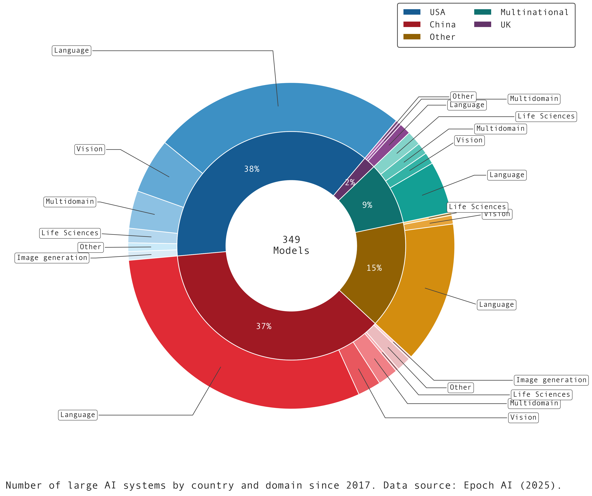

## Matt's Data Visualisation Library (`mattplotlib`)

The `mattplotlib` package provides a small, opinionated set of plotting helpers
layered on Matplotlib, Seaborn, and Plotly.

It includes a reusable Matplotlib style sheet and shared colour/font settings
to give figures a consistent look across backends.

### Quick start

```python
from mattplotlib import apply_mpl_style

apply_mpl_style()  # loads mattplotlib/styles/mattplotlib.mplstyle
```

### Configuration

- Defaults are defined in `mattplotlib/config.py`; copy
  `mattplotlib/config.example.toml` and set the `MATTPLIB_CONFIG` environment
  variable to point at your customised file.
- The bundled Matplotlib style sheet lives at
  `mattplotlib/styles/mattplotlib.mplstyle`. Override the `matplotlib_style`
  entry in the config if you maintain a personal theme elsewhere.

### Examples

See the `demo.ipynb` notebook for examples.



### Useful snippets

- **Loading colour palette**

  ```python
  from mattplotlib import get_config
  palette = get_config().color_cycle
  ```
